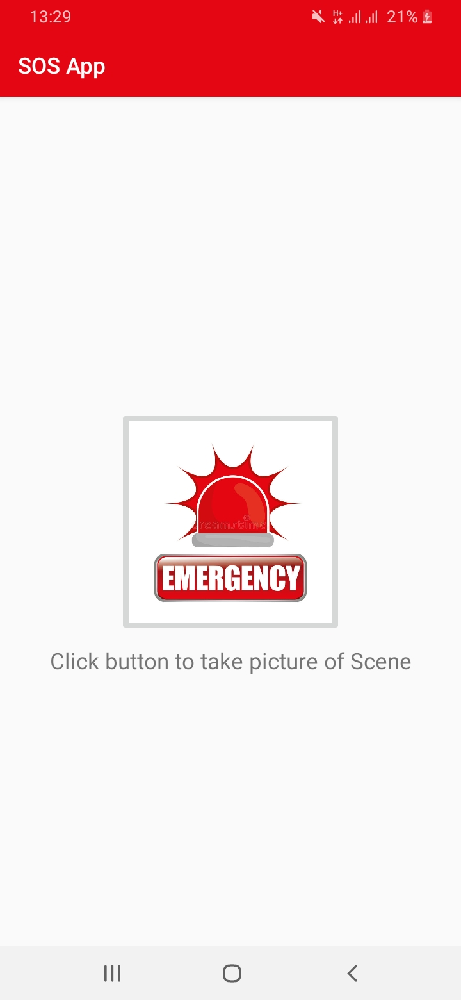
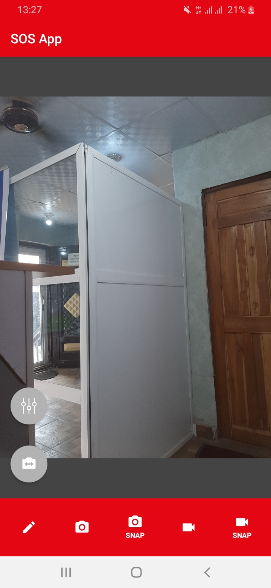
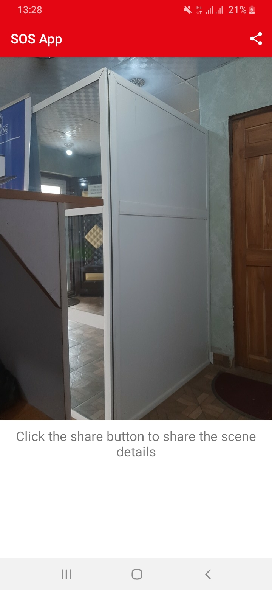
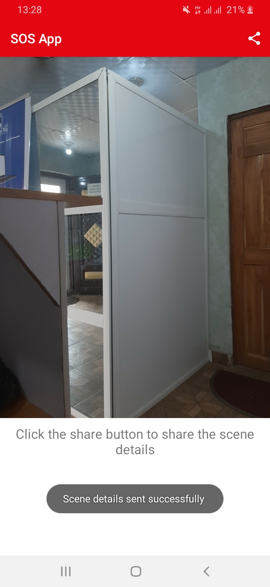

# Sos_app

This SOS app would help in contacting the police or family members, in a situation where you or someone is in distress and unable to make phone calls.
 
Here is what the app would do: 
1. Take a picture of the scene, encode it to base64 string
2. In real time, acquire the current location on the click of the capture image button
3. Send this information with preconfigured SOS numbers (i.e that of your family members or the police) via a REST endpoint (endpoint will be provided). 

## ✨ Features
* CameraView [OpenWeather API](https://github.com/natario1/CameraView)
* Google Location API 
* Retrofit

## 📸 Screenshots
||    ||    |
